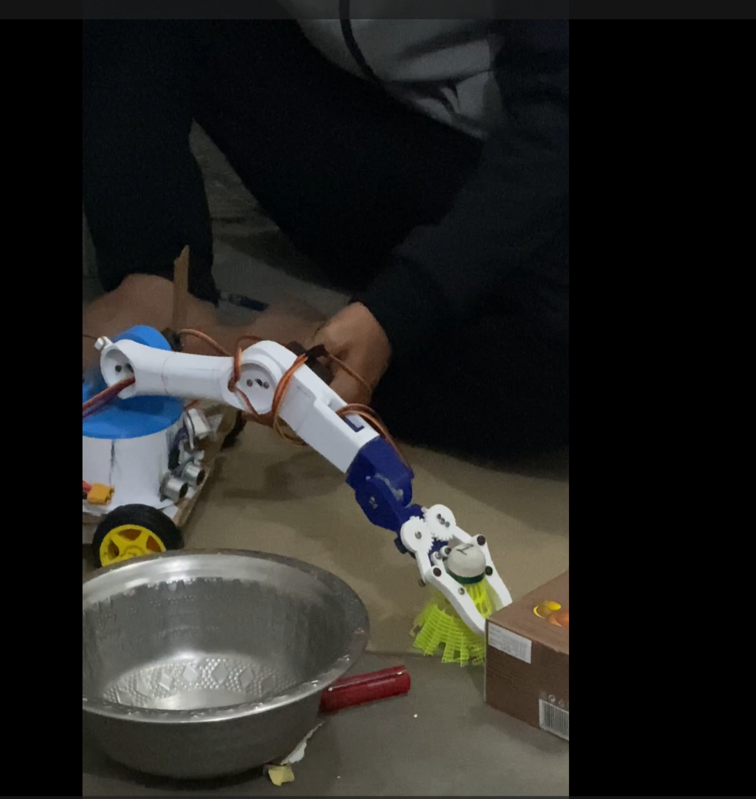
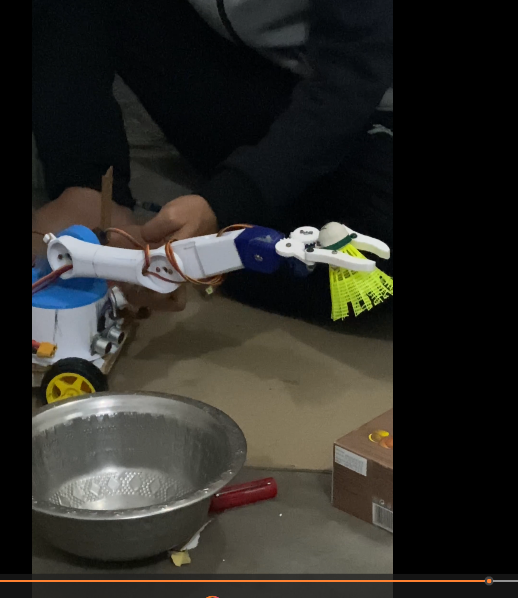
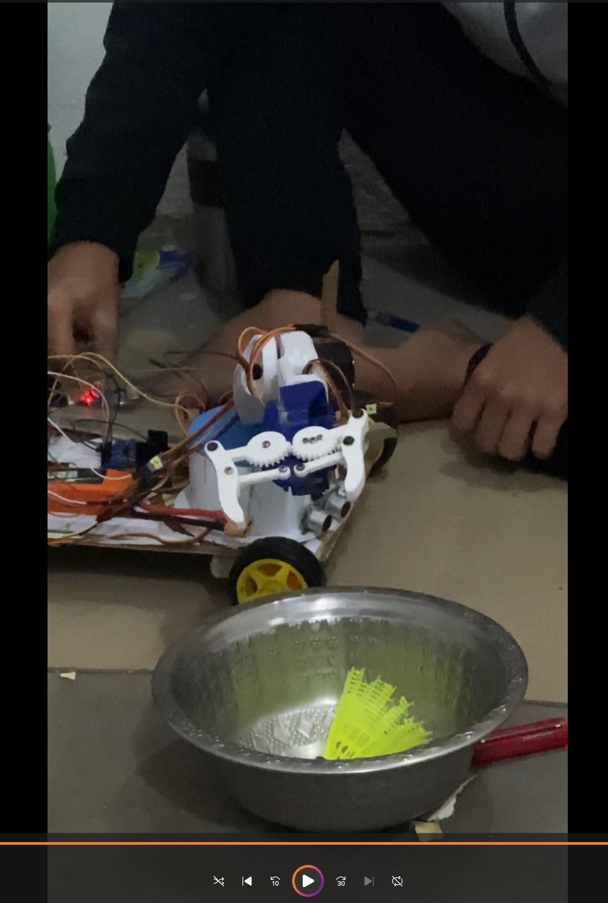

# Voice-Controlled Robotic Arm (Grab → Lift → Drop)

This project demonstrates a simple voice-triggered robotic system where a single command initiates a full sequence of physical actions.

The goal was to build an interactive system that connects user input (voice) with coordinated robotic movement.

---

## Overview

The system listens for a basic voice command and executes a predefined sequence:

- grip the object  
- lift the arm  
- move and release (drop)  

This project focuses on mapping input → action and ensuring consistent, repeatable behavior in a real-world robotic setup.

---

## Key Features

- Voice-triggered control using a single command  
- Coordinated multi-joint servo movement  
- Automated execution of a full task sequence  
- Repeatable and structured motion workflow  

---

## Command Behavior

The system responds to:

- **"grab"** → triggers the complete sequence:
  1. Close gripper  
  2. Lift object  
  3. Move and release (drop)  
  4. Return to ready position  

---

## Visual Demonstration

### Grab

### Lift

### Drop

---

## Project Video

Short demonstration of the robotic arm responding to voice input and executing the sequence:

[Watch demo here]([https://sofiauniversity-my.sharepoint.com/:v:/g/personal/santosh_bogati_sofia_edu/IQDzVXWx088MS7l8NzdqCqiPARP_ne4Rhgm3oObK0m5PCdM?nav=eyJyZWZlcnJhbEluZm8iOnsicmVmZXJyYWxBcHAiOiJPbmVEcml2ZUZvckJ1c2luZXNzIiwicmVmZXJyYWxBcHBQbGF0Zm9ybSI6IldlYiIsInJlZmVycmFsTW9kZSI6InZpZXciLCJyZWZlcnJhbFZpZXciOiJNeUZpbGVzTGlua0NvcHkifX0&e=fwarbL]

## System Workflow

1. Detect voice command  
2. Map command to predefined motion sequence  
3. Execute coordinated servo movements  
4. Complete action cycle and reset  

---

## Challenges

- Ensuring reliable command detection  
- Synchronizing multiple servo movements  
- Maintaining stability during lifting and dropping  
- Handling variation in real-world hardware behavior  

---

## Notes

This implementation focuses on simplicity and reliability by using a single command to trigger a complete workflow.

This approach reduces complexity in interaction while maintaining structured task execution.

---

## Technologies Used

- Arduino  
- Servo motors  
- C/C++ (Arduino environment)  
